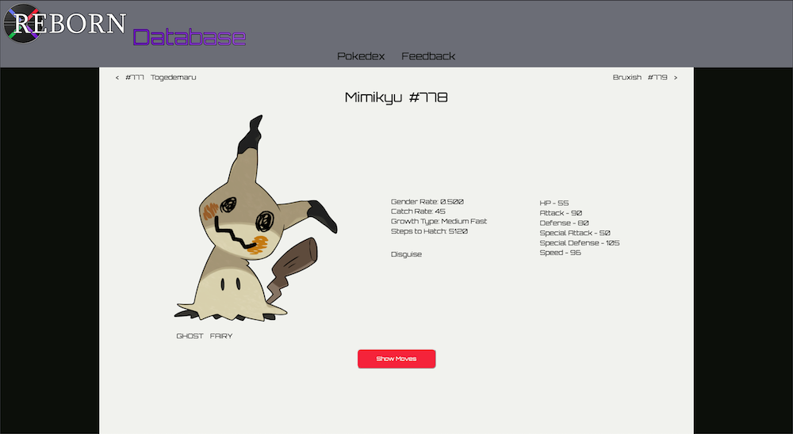

# Reborn Database

## Background
This project came about because I got tired of having to reference multiple different resources while playing through [Pokemon Reborn](https://www.rebornevo.com/). As a student at DevMountain, I decided that building this website would be the perfect remedy. So after getting permision from Ame, I began creating Reborn Database. 

## Technologies
This site was built using pure javascript for the front end and [Axios](https://github.com/axios/axios) for http requests. The back end is supported by [Express](https://github.com/expressjs/express) and connects to a PostgreSQL database via [Sequelize](https://expressjs.com/). Additionally, I used [Nightmare](https://github.com/segmentio/nightmare) to build some web scrapers to help me obtain some info that was missing from the PBS files supplied to me. Lastly, I used some basic Python to parse the PBS files and generage SQL seed files.

## Features
The features are pretty limited at the moment. Currently you can see a scrollable list of all pokemon in Pokemon Reborn.

   

After selecting a pokemon, you will be taken to their pokedex entry page where you can see some general info about them.

   

You can also see the moves they learn from level up and click on each move to get a bit more info about it.

   

There is also a simple feedback page that allows visitors to help me know what needs fixing, improving, or adding.

   
